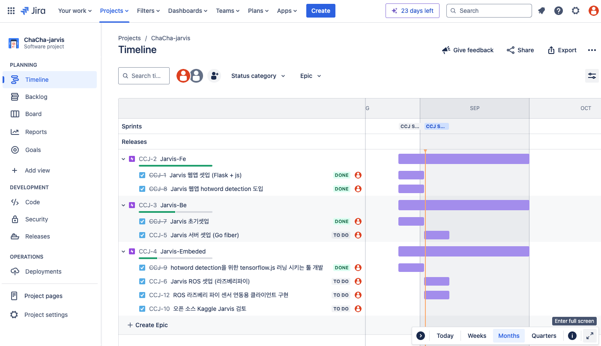
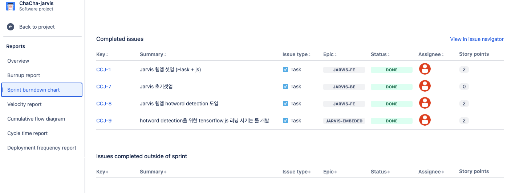
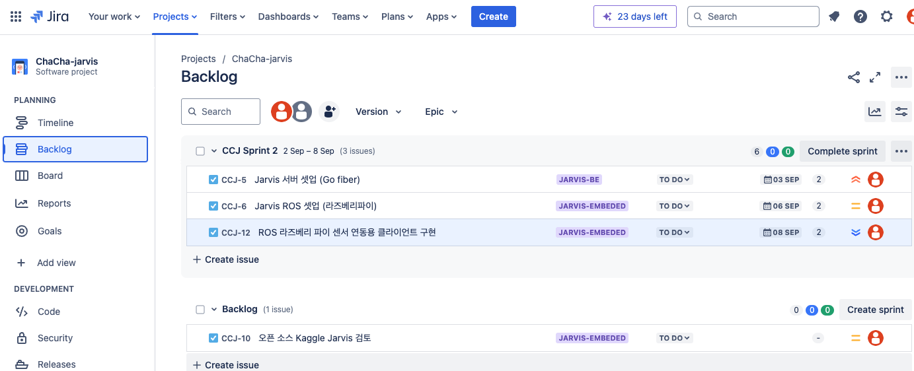
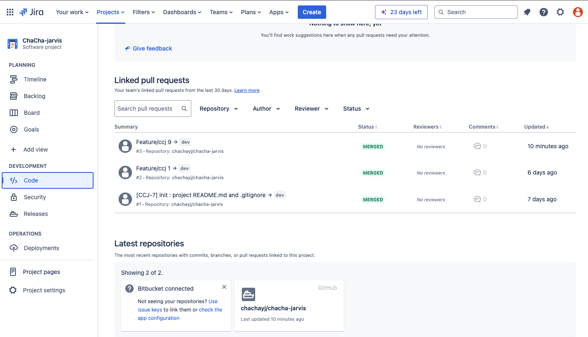

# chacha-jarvis
Ai 비서를 이용한 전구, 모터, 센서 등 라즈베리 디바이스들을 제어하는 IoT 시스템 프로젝트

# 프로젝트 구조

FrontEnd, BackEnd, Embeded 3개의 영역을 폴더별로 정리하였고

하위 요소들별 폴더를 만들은 mono repo 형태이다.

# 프로젝트 러닝 방법

- backend flask_server를 구동시켜서 웹애플리케이션을 호스팅하며
- backend go_fiber_server를 구동시켜서 웹앱플리케이션과 상호작용을 진행.

기본적으로 온프레미스 베이스에서 구동가능하도록 구현하였으며 ec2 셋업도 가능한 프로젝트이다.

# Jira의 Scrum board를 통해 1주 주기 Sprint 진행

Sprint를 통해 개발일정 스케줄링, 깃헙과 연동하여 백로그와 연동된 commit 관리.






# 구상중인 디렉토리 구조 (안)
```
Chacha-jarvis(monorepo)/
├── backend/
│   ├── flask_server/
│   │   └── app.py
│   └── go_fiber_server/
│       └── main.go
├── embeded/
│   ├── ai/
│   │   └── training-tfjs/
│   ├── ros/
│   │   └── rospy_app.py
└── frontend/
    ├── web/
    │   ├── static/
    │   │   └── augmented_audio
    │   │   └── css
    │   │   └── img
    │   │   └── js
    │   ├── templates/
    │   │   └── index.html

```