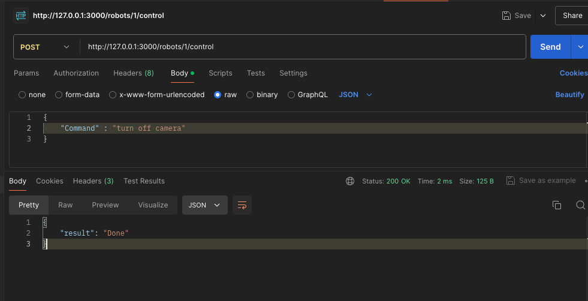
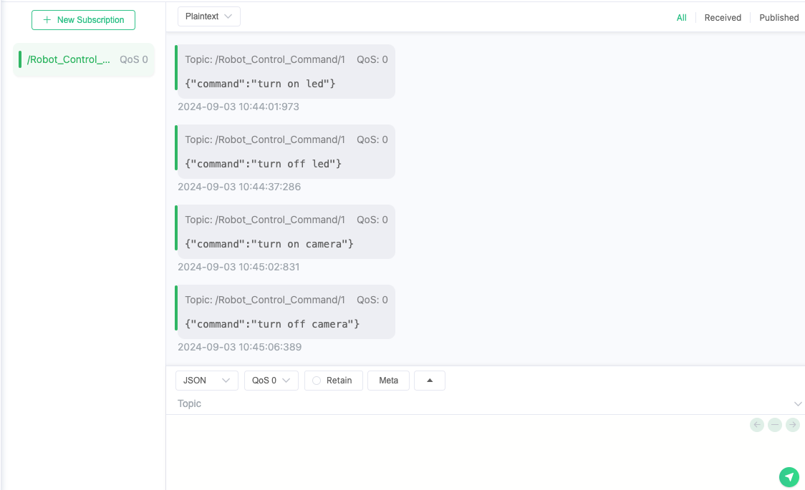

# chacha-jarvis-be-go

frontend/web에서 API call을 요청하는 go fiber 프레임워크를 사용한 core backend

- 언어
go1.22.5

- 프레임워크
fiber v2 (LTS)

- 모듈 의존성 설치
go mod tidy

- fiber 초기 셋업

go mod init go_fiber_server

go get github.com/gofiber/fiber/v2

- 서버 run

go run main.go

# robot api call 캡처

- postman api call

- mqttx mqtt spying

