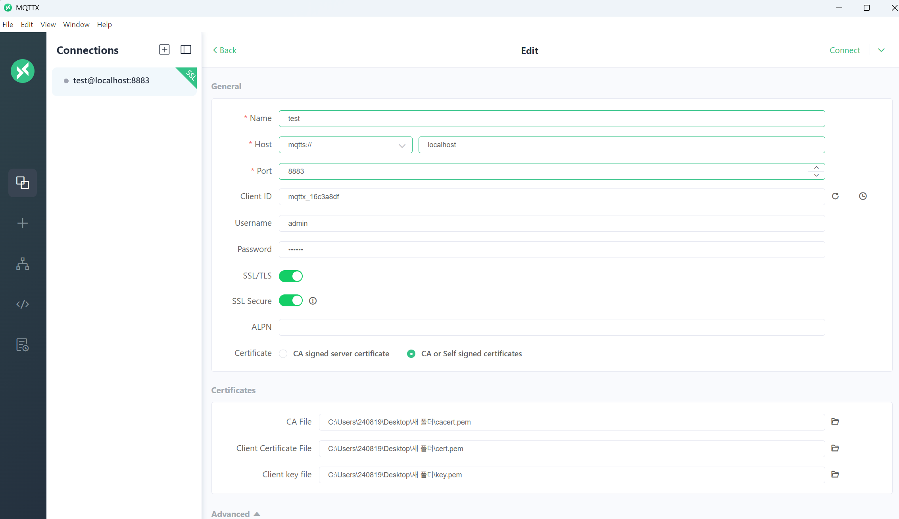
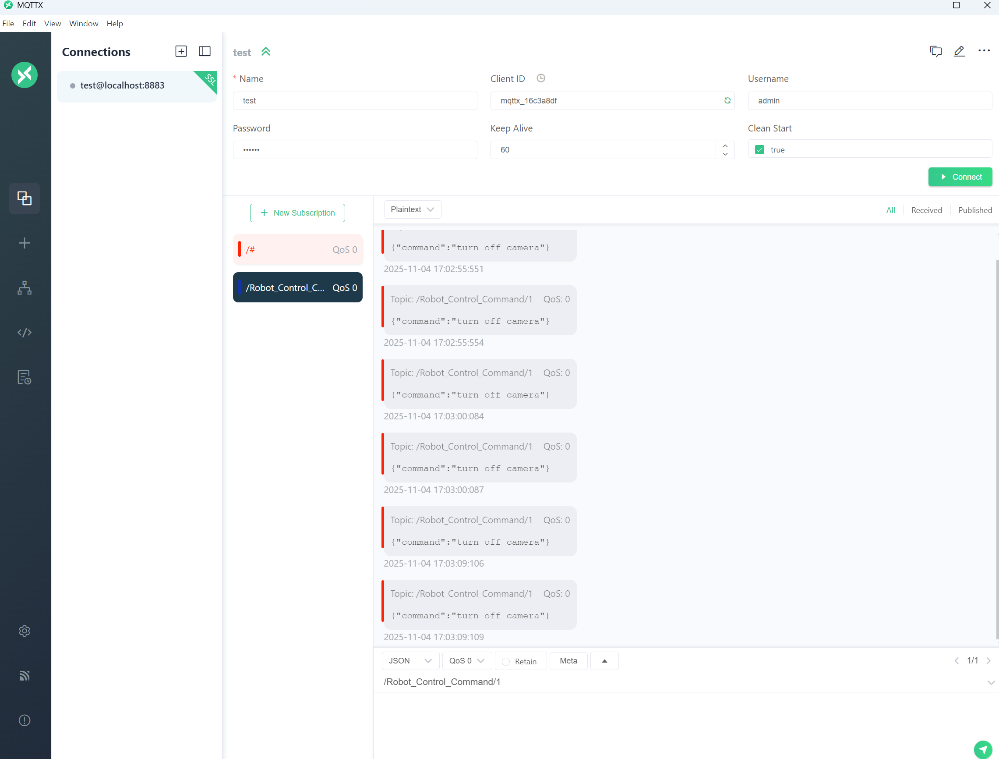
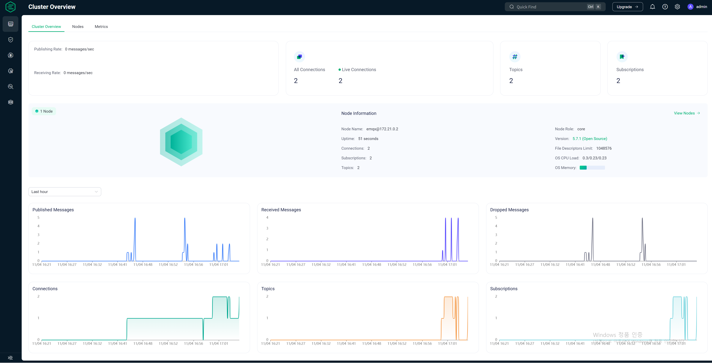

# EMQX


# 버전

emqx/emqx:5.7.1

# 🌐 EMQX Dashboard 접속 정보

http://localhost:18083

```
URL	👉 http://localhost:18083

기본 아이디	
admin
기본 비밀번호
public (기본셋이지만 Compose env로 세팅가능)
포트 매핑
18083:18083 (Compose에서 설정됨)

```

# mqttx mqtt spying 접속
```
반드시 본인 mqtts localhost 8883 port 를 사용하여야한다. (port가 달라도 메시지 수신 불가)

pem키는 도커 컴포즈 실행시에 생성된 pem키를 사용

정상 connect 시 new Subscribe에서

topic 

/#
/Robot_Control_Command/1

둘중 하나를 사용하여 spying 할수 있다. 

```






# emqx는 아래와 같이 대시보드도 제공


