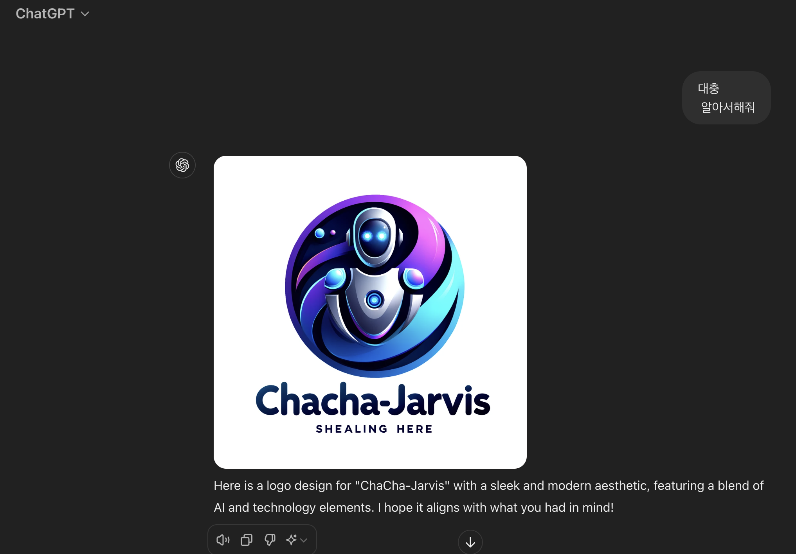

# chacha-jarvis-fe-web

azure avartar demo 기반의 샘플 코드로 작업 진행

https://github.com/Azure-Samples/cognitive-services-speech-sdk/tree/master/samples/js/browser/avatar

# hot word detection 구현 (tensorflow.js 사용)

- 사전 러닝된 tensorflow.js 모델(Pre-trained Models) 다운받아사용.

음성인식이 주 목적이므로 speech-commands 선정

https://www.tensorflow.org/js?hl=ko

https://github.com/tensorflow/tfjs-models
```
- 이미지 분류: mobilenet 또는 coco-ssd
이미지에서 객체를 분류하거나 감지할 때 사용합니다. 예를 들어, 사진에서 개와 고양이 등을 구분할 수 있습니다.

- 사물 검출: coco-ssd
이미지에서 특정 객체(예: 사람, 자동차)를 감지하고 그 위치를 파악하는 데 사용됩니다.

- 포즈 추정: posenet 또는 blazepose
사람의 신체 움직임을 감지하거나 추적하는 데 유용합니다. 예를 들어, 피트니스 앱에서 자세를 분석할 수 있습니다.

- 텍스트 분류 및 감정 분석: use (Universal Sentence Encoder)
문장을 임베딩으로 변환하여 텍스트 분류나 감정 분석을 수행할 때 사용합니다.

- 음성 인식 및 처리: speech-commands
특정 음성을 인식하는 작업에 사용됩니다. 음성 명령 기반의 애플리케이션을 만들 때 유용합니다.
```
# logo info (chatgpt 4.0로 생성)

DALL·E 2024-08-27 - A sleek and modern logo for 'ChaCha-Jarvis' featuring a blend of technology and AI elements. The design should have a futuristic feel with smooth curv.webp

