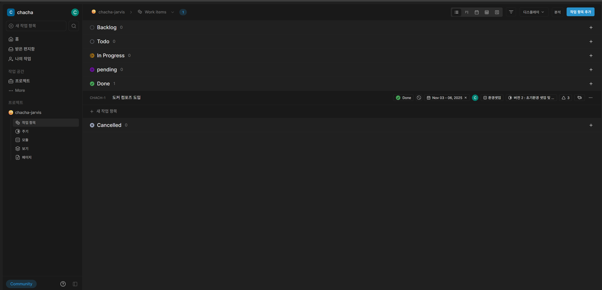
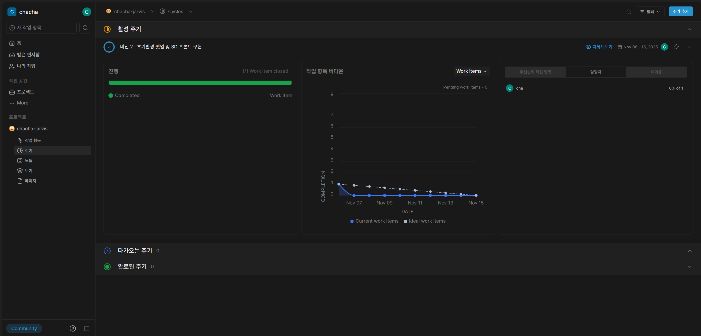
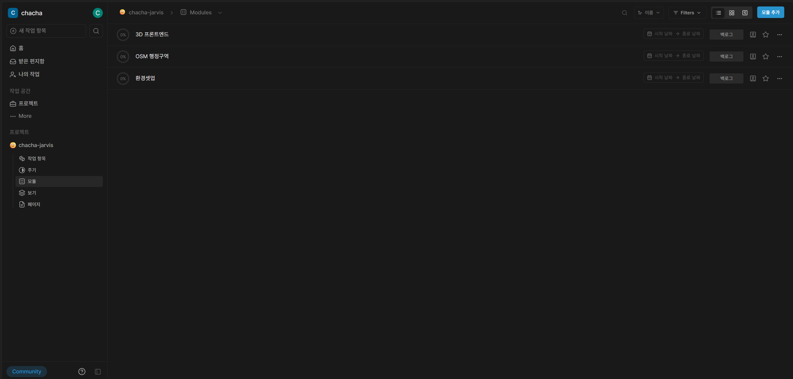
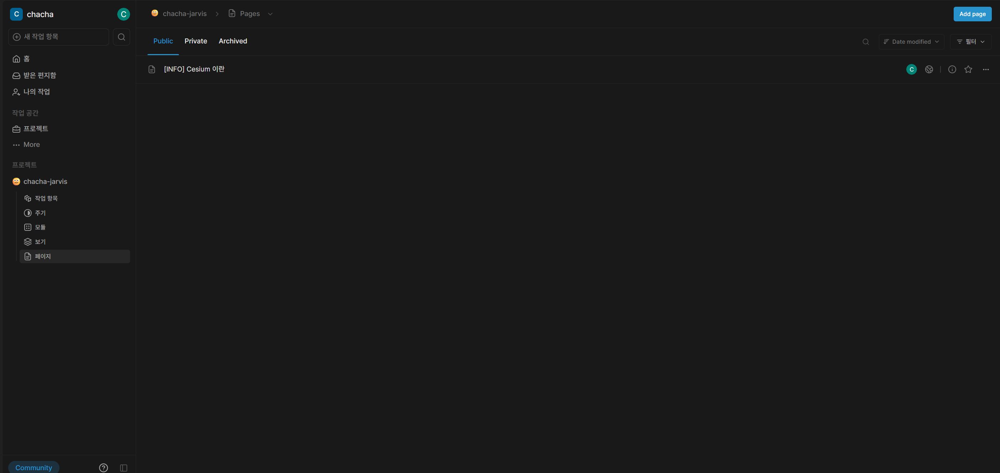

# Plane (스크럼 플래닝 툴 : 개발 계획 도구)

plane 은 현재 self host 방식은 도커 데스크탑을 사용하게 되어있습니다.

기존적으로 스크럼 방식을 채택하여 개발 계획을 진행했습니다.

2주 단위의 Cycle (sprint)로 작업했습니다. 


# 설치

1. Docker Desktop 켜기

2. plane-selfhost배포 및 데이터 저장을 위해 컴퓨터에 다음 이름의 폴더를 만듭니다 .

```
mkdir plane-selfhost
```

3. cd 명령을 사용하여 이 폴더로 이동합니다.

```
cd plane-selfhost
```

4. 최신 안정 릴리스를 다운로드하세요. (이미 파일은 다운로드 해두었습니다.)
```
curl -fsSL -o setup.sh https://github.com/makeplane/plane/releases/latest/download/setup.sh
```

5. 파일을 실행 가능하게 만듭니다.
```
chmod +x setup.sh
```

6. 다음 명령을 실행하세요.
```
./setup.sh
```

7. 그러면 아래 옵션이 표시됩니다.
```
Select a Action you want to perform:
   1) Install (arm64)
   2) Start
   3) Stop
   4) Restart
   5) Upgrade
   6) View Logs
   7) Backup Data
   8) Exit
Action [2]: 1
```
8. 입력란에 입력하세요 1. 그러면 폴더가 생성되고 plane-app( plane-app-preview미리 보기 배포의 경우) 및 파일 docker-compose.yaml이 다운로드됩니다 plane.env.

9. 환경 변수를 설정하세요. 텍스트 편집기를 사용하여 이 파일을 편집할 수 있습니다. 다음은 반드시 참조해야 하는 가장 중요한 키입니다.

```
LISTEN_HTTP_PORT: 기본적으로 설정되어 있습니다 80. 사용하려는 포트가 이미 사용 중이 아닌지 확인하세요. 예를 들어,LISTEN_HTTP_PORT=8080
LISTEN_HTTPS_PORT: 기본적으로 설정되어 있습니다 443. 사용하려는 포트가 이미 사용 중이 아닌지 확인하세요. 예를 들어,LISTEN_HTTPS_PORT=4430
WEB_URL: 기본적으로 설정되어 있습니다 http://localhost. LISTEN_HTTP_PORT와 함께 사용할 FQDN으로 변경하세요. 예를 들어, https://plane.example.com:8080또는 http://[IP-ADDRESS]:8080.
CORS_ALLOWED_ORIGINS: 기본적으로 설정되어 있습니다 http://localhost. LISTEN_HTTP_PORT와 함께 사용할 FQDN으로 변경하세요. 예: https://plane.example.com:8080또는 http://[IP-ADDRESS]:8080.

```

10. 다시 ./setup.sh 파일을 실행한후 2번 옵션 start를 통해 구동하세요. 구동전에 아래 데이터 복원을 진행한후 start합니다. 

# PostgreSQL 데이터 백업 (프로젝트 진행시의 plan 데이터들입니다.)
1. 빈 볼륨 생성
docker volume create plane-app_pgdata

2. tar 복원
docker run --rm \
  -v plane-app_pgdata:/data \
  -v $(pwd):/backup \
  alpine sh -c "cd /data && tar xzf /backup/plane_pgdata.tar.gz"

# 접속 계정

계정 : cha@cha.cha

PW : !Admin1234

# 접속 URL

http://localhost/chacha


# PostgreSQL 데이터 볼륨 백업
# 볼륨 백업 실행
docker run --rm \
  -v plane-app_pgdata:/data \
  -v $(pwd):/backup \
  alpine sh -c "cd /data && tar czf /backup/plane_pgdata.tar.gz ."


# Plane 사용 예시





