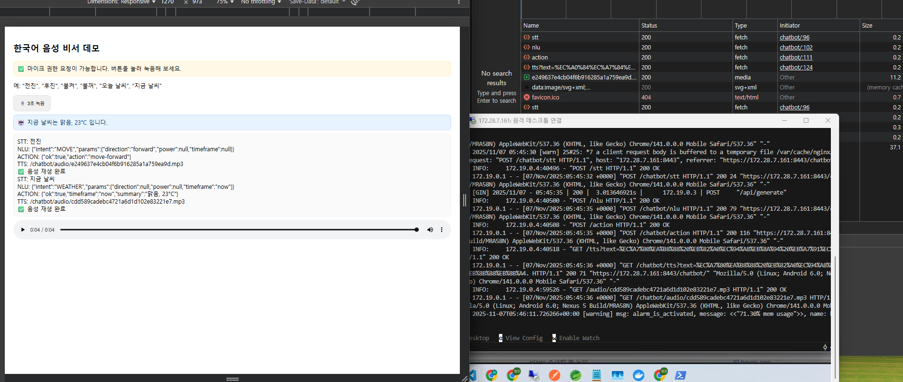

# Chatbot (voice-assistant)

음성 인식, 올라마로 명령어 인식하여 응답을 주는 어시스턴트이다.

FastAPI, Whisper, Ollama + Llama3, gTTS 를 사용하여 구현.

# 필요시 구동 참고 (현재 docker 컴포즈로 한번에 구동되도록 설정)
<!-- docker compose up -d ollama 개별 구동 -->
## docker compose up 을 통해 전체 구동 시킨후 올라마 개별 구동 필요.
docker exec -it ollama ollama pull llama3.1:8b

# serve hosts
https://서버IP:8443/chatbot

https://localhost:8443/chatbot


# WSL용 port 오픈

netsh interface portproxy add v4tov4 listenport=8443 listenaddress=0.0.0.0 connectport=8443 connectaddress=172.20.223.124


# 🧠 전체 아키텍처 개요
```
🎙️ 음성 입력 (마이크)
   ↓
[FastAPI 서버: voice-assistant]
   ↓
1️⃣ STT (Whisper)
   ↓
2️⃣ NLU (Ollama + Llama3)
   ↓
3️⃣ ACTION 실행 로직
   ↓
4️⃣ TTS (gTTS)
   ↓
🔊 음성 응답 (브라우저 재생)
```

# API별 설명
```
/chatbot/stt        → 음성 파일 업로드 → Whisper STT
/chatbot/nlu        → 텍스트 → Ollama LLM 분석 (의도 파악)
/chatbot/action     → intent 기반 실제 동작 + say 문장 생성
/chatbot/tts        → say 텍스트 → 음성(mp3) 변환
```


# 실행 예시 이미지




<video src="chatbot-work-result.mp4" controls width="640"></video>